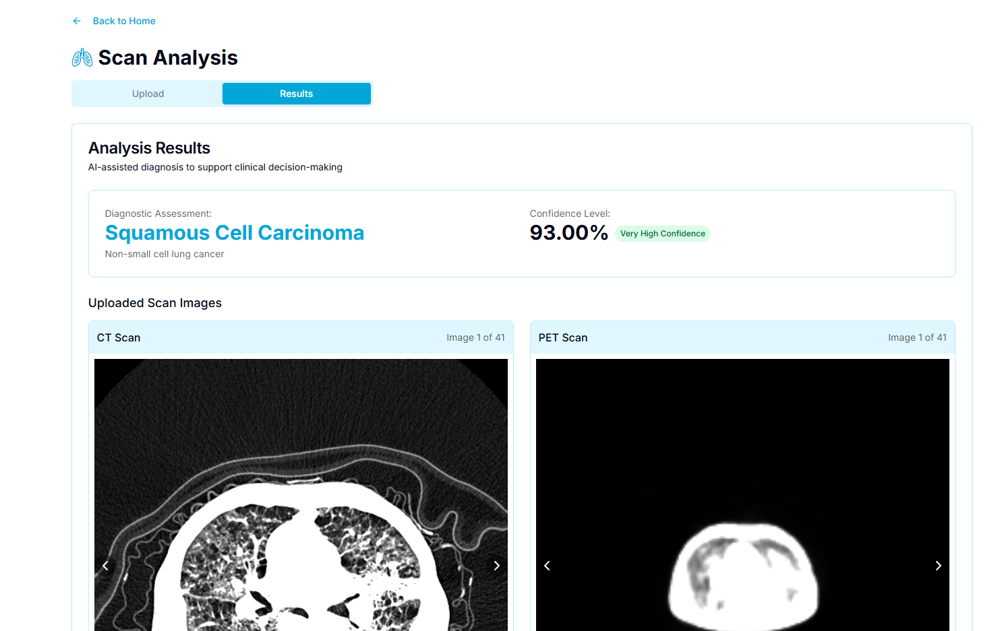

# 🫁 LUMINA - LUng Multimodal Integrated Network Assistant

This frontend project is a **Web Agent** built to interact with our developed Deep Learning Model in classifying subtypes of lung cancer based on CT and PET scans and with our developed Regression Model in detecting the presence of lung cancer through symptoms. 
This is part of our final project for on Artificcial Intelligence and Data Science courses A.Y. 2024-2025.

- Note: The model is trained on patients with lung cancer only and that scans not having lung cancer is not part of the project's scope. 

---

## 🚀 Agent in Action
### Check this out: [Demo Video](https://youtu.be/E5FFvdfVPn0)

## 📌 Features

### 🤖 Classifying Lung Cancer using 3D DenseNet Model 
- User uploads at least 15 slices of CT and PET Scans
- Shows the classification of Lung Cancer present in both slices
- Shows the model's accuracy of the classification

### 📊 Symptom-Based Lung Cancer Detection using Regression Model
- User fills out a symptoms form
- Detects lung cancer presence based on symptoms
- Shows top contributing factors in the model's prediction

---

## 🚀 Getting Started

### 📦 First, clone the project, then install the dependencies needed:

```bash
npm install
# or
yarn install
# or
pnpm install
# or
bun install
```

### 🏃‍♂️ Run the development server then open http://localhost:3000 

```bash
npm run dev
# or
yarn dev
# or
pnpm dev
# or
bun dev
```

### ⚠️ Make sure to run the backend. 
- Check this repository and follow the steps for running the backend of this project. <br>
[LUMINA-backend-ai](https://github.com/Stephen-Coloma/LUMINA-backend-ai)

### 🧪 Finally, Test the agent by uploading CT and PET scans stored in the directory public/test-data 

--- 

## 🚀 Screenshots

### Homepage

### Scan Upload

### Lung Cancer Classification Result

### Symptoms Upload

### Lung Cancer Detection Result


---

## 🔧 Tech Stack

- **Framework:** Next.js (React)
- **Language:** TypeScript
- **Backend** [LUMINA-backend-ai](https://github.com/Stephen-Coloma/LUMINA-backend-ai)
- **Design:** Tailwind CSS, v0, Figma
- **Libraries** Axios, Framer Motion, dicom-parser, jszip

---

## 💻 Developers
1. BALOGO, Renuel Jeremi V.  
2. COLOMA, Stephen M.
3. GUZMAN, Sanchie Earl M.
4. LEUNG, Leonhard T.
5. NONATO, Marius Glenn M.
6. RAGUDOS, Hannah T.
7. RAMOS, Jerwin Kyle R.
